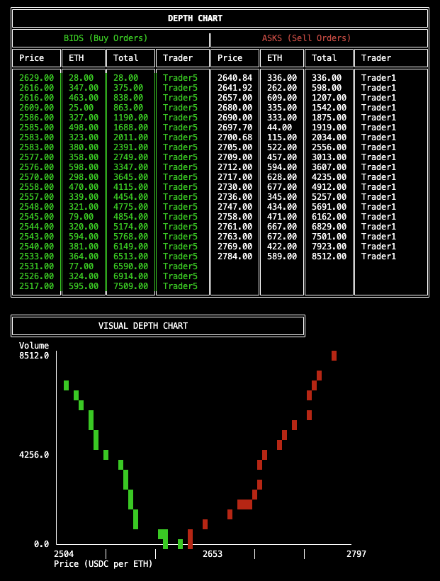

# Miden CLOB




## Running the demo:
```
./run_demo.sh
```

## Running the Depth Chart CLI tool:
```
cargo run --bin depth_chart
```

## Running tests:
```
cargo test --release -- --test-threads=1
```

```
cargo test --release  swap_note_edge_case_test -- --exact --nocapture
```

#### Note:
This is a WIP / Expiremental project