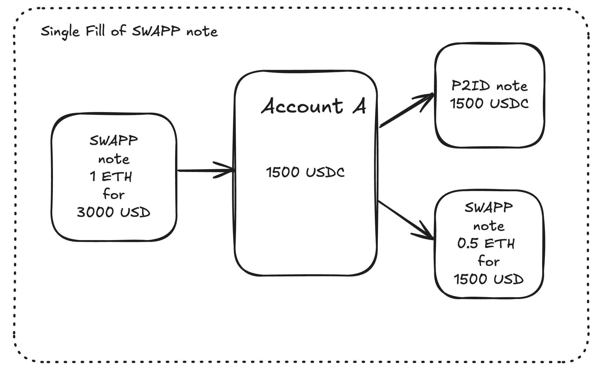
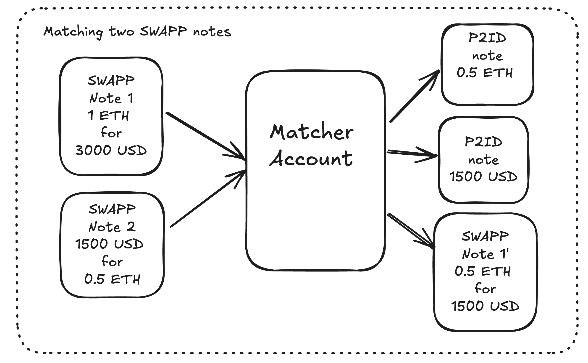
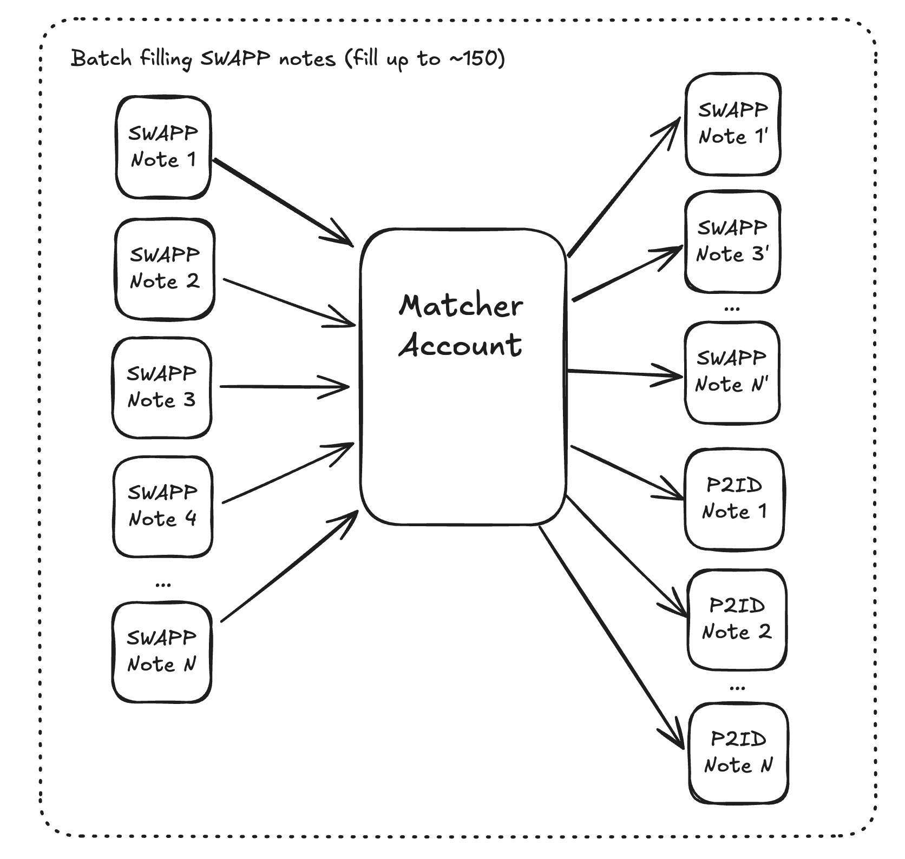

# Miden CLOB


# Architecture

### Single fill of a SWAPP note


The core of the zkCLOB on Miden is the SWAPP note. SWAPP stands for "Partially Fillable SWAP" (as opposed to the standard SWAP note which is not partially fillable).

In the image above, the SWAPP note is filled by a single account.

### Matching two SWAPP notes against each other


Since it isn't very efficient if every user needs to generate a transaction to fill other user's orders, we can match the SWAPP notes of two traders together. There are 2 possible outcomes:
- Note 1 is partially filled, and note 2 is completely filled.
- Both SWAPP notes are completely filled.

### Batch matching multiple SWAPP notes


To further improve order settlement speed, we can batch match many SWAPP notes at a time.

## Running the demo:
```
./run_demo.sh
```

## Running the Depth Chart CLI tool:
```
cargo run --bin depth_chart
```

## Running tests:

Running all tests:
```
cargo test --release -- --test-threads=1
```

Running tests that don't use the client: 
```
cargo test -- --ignored
```

Running specific test
```
cargo test --release  swap_note_edge_case_test -- --exact --nocapture
```


#### Note:
This is a WIP / Expiremental project