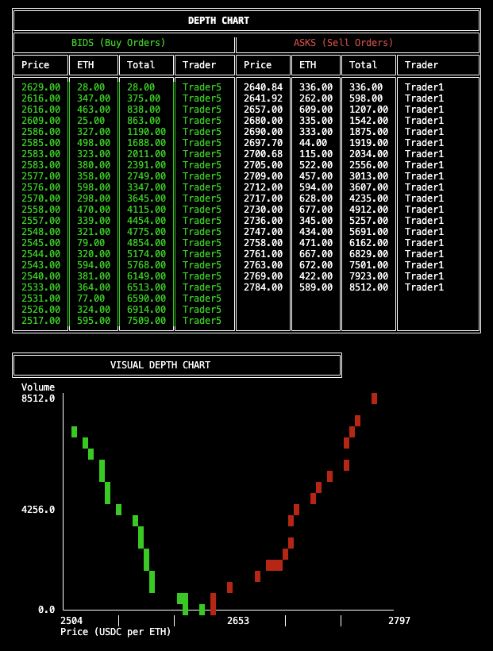
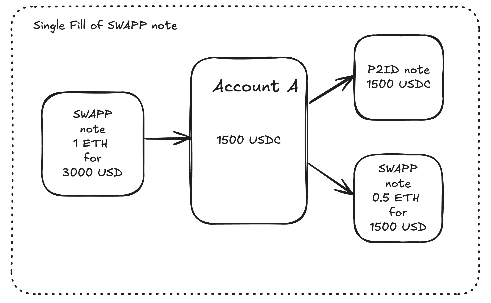
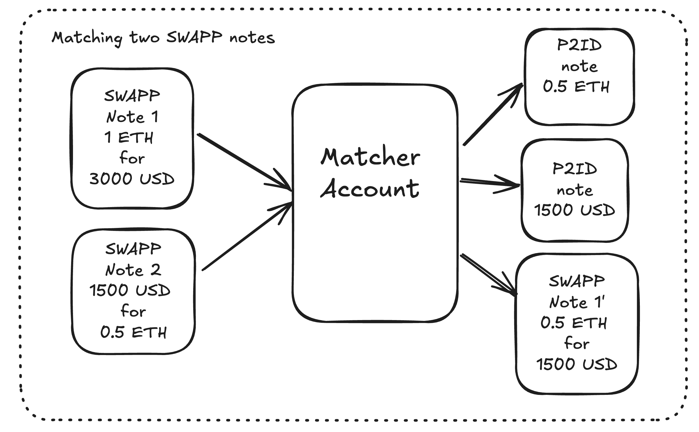
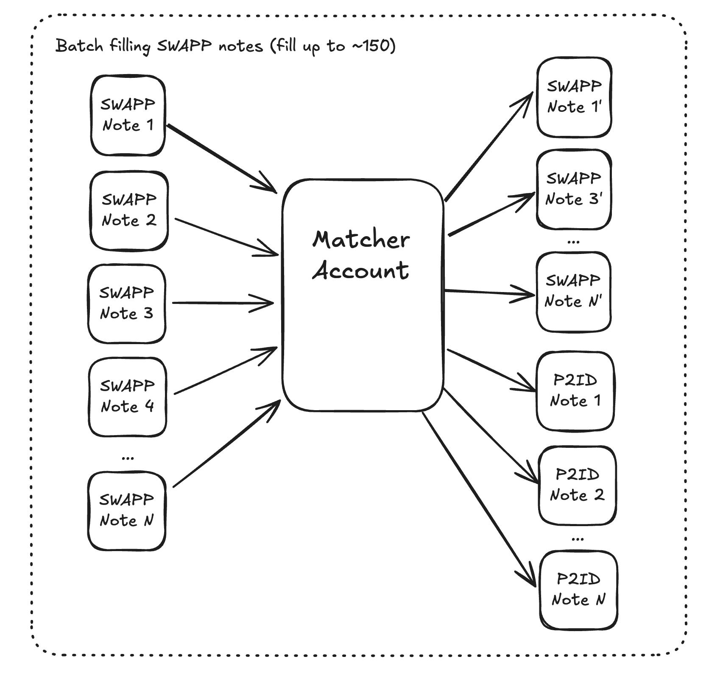

# Miden CLOB



# Architecture

### Single fill of a SWAPP note


The core of the zkCLOB on Miden is the SWAPP note. SWAPP stands for "Partially Fillable SWAP" (as opposed to the standard SWAP note which is not partially fillable).

In the image above, the SWAPP note is filled by a single account.

### Matching two SWAPP notes against each other


Since it isn't very efficient if every user needs to generate a transaction to fill other user's orders, we can match the SWAPP notes of two traders together. There are 2 possible outcomes:
- Note 1 is partially filled, and note 2 is completely filled.
- Both SWAPP notes are completely filled.

### Batch matching multiple SWAPP notes


To further improve order settlement speed, we can batch match many SWAPP notes at a time.

## Running the CLOB on testnet:

1. Start the server order database server:
```bash
cargo run --bin server
```

2. In a separate terminal window, setup accounts and faucets, then populate orders:
```bash
cargo run --release --bin populate -- --setup
cargo run --release --bin populate
```

3. In a separate terminal window (after step 2 begins populating orders), start the matching engine:
```bash
cargo run --release --bin matching_engine
```

4. In a separate terminal window (after step 2 begins populating orders), view the CLOB depth chart:
```bash
cargo run --bin depth_chart
```

#### Note:
This is a WIP / Expiremental project